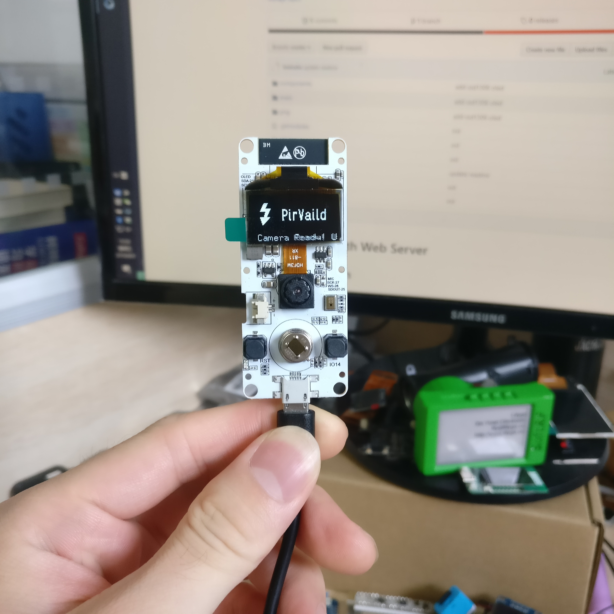
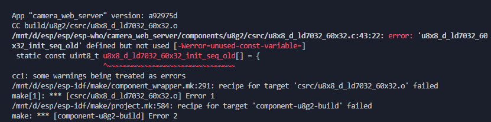

# Camera with Web Server




# Preparation
To run this example, you need the following components:
- [esp-who](https://github.com/espressif/esp-who) framework

# Quick start

1. Place this project file in the esp-who root directory
2. Configure the example via `make menuconfig`;
3. Build and Flash  `make -j && make flash monitor` ESP32 application;
4. When you see the screen saying "Please say 'Hi LeXin' to the board", please say `hi lexin` wake-up words to it, when it wakes up it will turn on the web server
5. Connect to the hotspot that the board opens. The default name is `ESP_Camera`
6. Open the browser and point it to `http:// [ip-of-esp32] /`;
7. Get image Press “Get Still” or “Start Stream”;
8. Use options to enable/disable face detection, face recognition and other functions;

# Detailed steps:
```
git clone --recursive https://github.com/espressif/esp-who.git 
cd esp-who
git clone --recursive https://github.com/Xinyuan-LilyGO/TTGO-Camer-Mic.git
make menuconfig
make -j
make flash monitor
```

***When compiling under the Windows WLS liunx subsystem, you may encounter the error as shown in the figure. The solution is to find the file and comment out the unused variables.***



# Environmental description
This project is built on the esp-who hash version: fec860da


